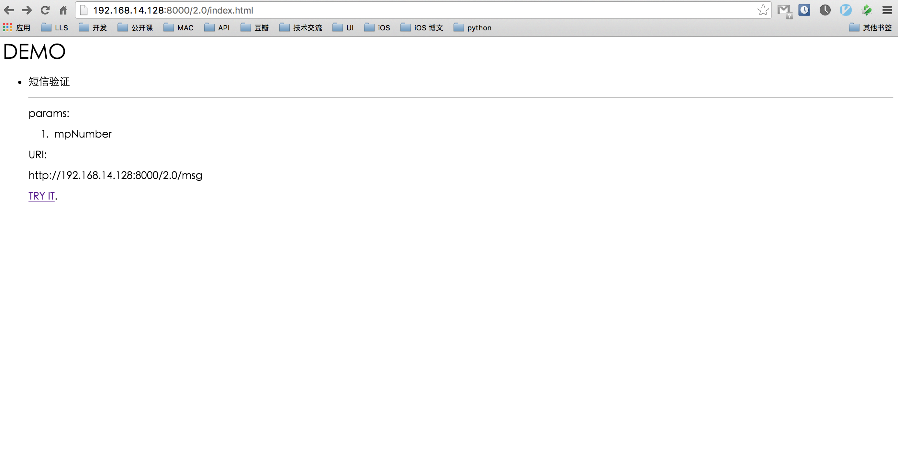
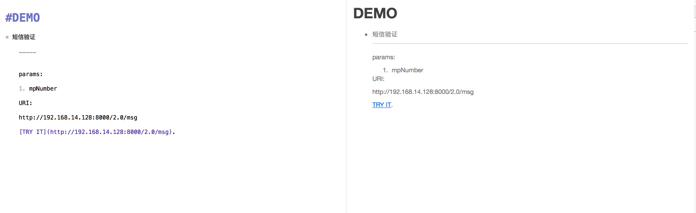
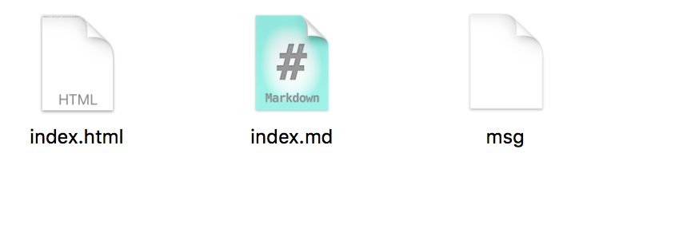
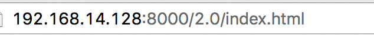

# PYJsonMock
On django &amp; written in python, it could help u mock data of json

Support interface index:

Look like this:

Mark Down supported

All you need is just to drop you json file here

then you could visit the url like this

